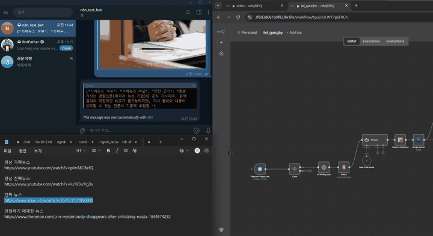
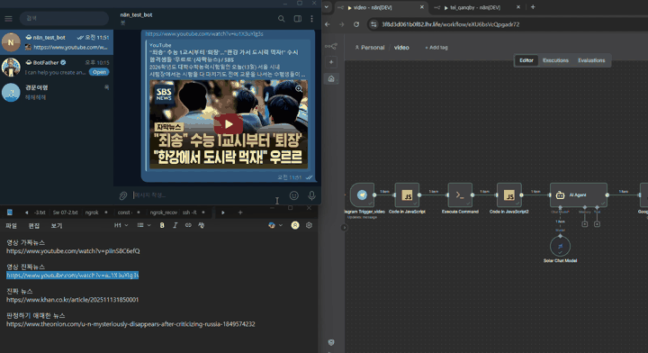
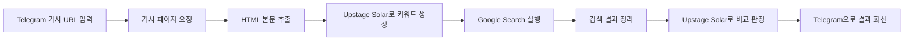
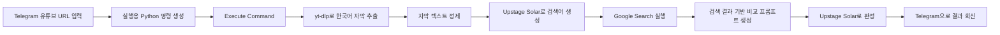

# 가짜뉴스 판독기

2025 Upstage Agentic Workflow Hackathon에서 제작한 `n8n` 기반 팩트체킹 자동화 프로젝트입니다.  
팀 `EZ U`는 텔레그램 봇을 입력 창으로 사용해 뉴스 기사 URL과 유튜브 영상 URL을 받아, 본문 또는 자막을 추출한 뒤 `Upstage Solar`와 `Google Search`를 조합해 가짜뉴스 가능성을 빠르게 점검하는 워크플로우를 구현했습니다.

## 프로젝트 한 줄 소개

- 기사 URL을 보내면 본문을 수집하고 관련 키워드를 추출한 뒤 검색 결과와 비교해 사실 여부를 판별합니다.
- 유튜브 URL을 보내면 자막을 추출하고 검증용 검색어를 생성한 뒤 검색 결과를 기반으로 가짜뉴스 여부를 판단합니다.
- 모든 결과는 텔레그램으로 다시 회신되어, 비개발자도 쉽게 사용할 수 있습니다.

## 왜 만들었는가

최근 가짜뉴스와 딥페이크 콘텐츠가 빠르게 확산되면서 일반 사용자가 진위를 판별하기 어려운 상황이 많아졌습니다.  
이 프로젝트는 복잡한 검증 절차를 직접 수행하지 않아도, 메신저에 링크만 보내면 `수집 -> 분석 -> 검색 -> 비교 -> 회신`이 한 번에 이어지는 경험을 만드는 데 초점을 맞췄습니다.

## 데모

### 기사 판별 데모



### 영상 판별 데모



## 핵심 기능

### 1. 뉴스 기사 팩트체킹

- 텔레그램으로 기사 URL 입력
- 기사 본문 HTML 수집 및 텍스트 추출
- Solar 모델로 검색용 키워드 생성
- Google Search 결과 상위 문서와 원문 비교
- 텔레그램으로 판별 결과 회신

### 2. 유튜브 영상 팩트체킹

- 텔레그램으로 유튜브 URL 입력
- `yt-dlp`를 사용해 한국어 자막 추출
- 자막 내용을 기반으로 검색 쿼리 생성
- 검색 결과와 원본 내용을 비교해 진위 여부 판단
- 텔레그램으로 판별 결과 회신

## 워크플로우 구조

### 기사 URL 판별 워크플로우



대응 파일: `tel_gangby.json`

### 유튜브 영상 판별 워크플로우



대응 파일: `video.json`

## 기술 스택

- `n8n`
- `Telegram Bot`
- `Upstage Solar Pro 2`
- `SerpApi Google Search`
- `JavaScript` Code Node
- `Python + yt-dlp` for subtitle extraction

## 실행 방법

1. `n8n`에 `tel_gangby.json`과 `video.json`을 각각 import 합니다.
2. 아래 자격 증명을 연결합니다.
   - Telegram Bot
   - Upstage API
   - SerpApi
3. `video.json`을 사용할 경우, `Execute Command` 노드가 실행되는 환경에 `python3`가 있어야 합니다.
4. 텔레그램 봇에 기사 URL 또는 유튜브 URL을 전송합니다.
5. 워크플로우가 자동으로 검색과 비교를 수행한 뒤 결과를 회신합니다.

## 파일 구성

```text
.
├── README.md
├── tel_gangby.json
├── video.json
└── assets
    ├── demo-news.gif
    └── demo-video.gif
```

## 구현 포인트

- 기사 워크플로우는 `본문 수집 -> 키워드 추출 -> 검색 결과 비교` 흐름으로 구성되어 있습니다.
- 영상 워크플로우는 자막을 직접 추출해 텍스트 기반 검증으로 연결한 것이 핵심입니다.
- 검색 결과의 개수와 출처 성격을 함께 고려하도록 프롬프트를 구성해 단순 요약이 아니라 판별에 가깝게 동작하도록 설계했습니다.
- 텔레그램을 입출력 채널로 사용해 실제 사용자 경험을 간단하게 만들었습니다.

## 한계와 개선 방향

- 기사 본문 추출은 사이트 구조에 따라 품질 차이가 있을 수 있습니다.
- 영상 자막이 없거나 자동 생성 자막 품질이 낮은 경우 정확도가 떨어질 수 있습니다.
- 현재 판별은 검색 결과 기반 보조 판단이므로, 최종 검증 도구라기보다 1차 필터링 도구에 가깝습니다.
- 향후에는 신뢰도 점수, 출처별 가중치, 대시보드형 UI, 결과 저장 기능을 추가하면 더 완성도 높은 서비스로 확장할 수 있습니다.

## 팀

- 팀명: `EZ U`
- 팀원: `이경문`, `유강비`, `지민구`

## 비고

- 워크플로우 JSON에는 자격 증명 이름이 포함되어 있을 수 있지만, 실제 비밀키 값은 저장소에 포함하지 않는 것을 권장합니다.
- `video.json`의 `Execute Command`는 현재 PowerShell 기반으로 작성되어 있어 Windows 환경에서 바로 사용하기 좋습니다. macOS 또는 Linux 환경에서는 해당 명령 부분을 환경에 맞게 바꾸면 됩니다.
